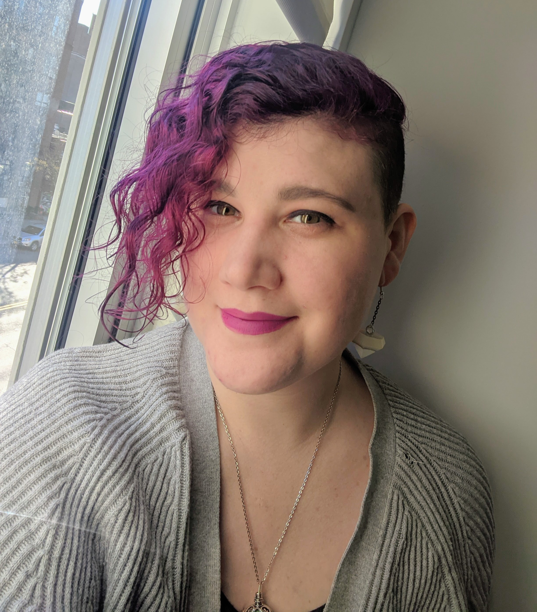

{{}}

I love cooking and baking (especially bread). I have no formal training, and
just enjoy learning through doing, and I am getting better at accepting my
failures as learning opportunities.

I am originally from South Jersey, so on the Pork Roll vs Taylor Ham debate: I
call it "Pork Roll", I've called it Pork Roll my whole life. If you call it
"Taylor Ham" I hold no animosity towards you, but I might forget what you're
talking about from time to time.

When I’m not making a mess of my kitchen I’m cuddling my cat, reading, and
occasionally traveling.

{{}}
