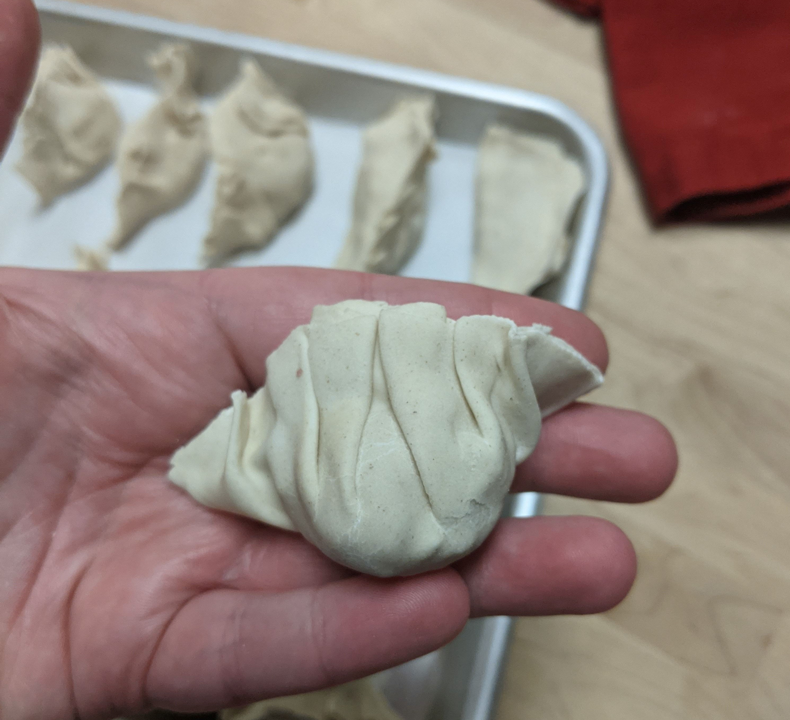
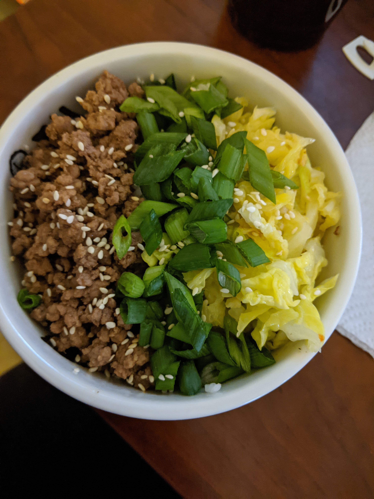

---
categories:
    - Not a Recipe
tags:
    - Baking
    - Bread
    - Cookies
    - Projects
title: "What I Cooked, Baked, and Ate - February 2021"
date: 2021-02-28T10:51:40-05:00
featured: 1
draft: false
description:
    "A round up of the things I enjoyed making and eating in February 2021"
---

I know February is the shortest month, but man did it fly by for me. All of a
sudden I was looking at the calendar and needing to plan for March. I did a fair
amount of recipe testing this month (compared to the past few months) and I
think I have at least one or two recipes that are ready to see the light of day!

I ate a lot of repeats from last month- either because they were really good, or
because I'm still working on the recipe. I also had a few failed recipes this
month. I am thankful I am able to see where things went wrong and learn from my
mistakes, but it still sucks to make something that isn't what you expected, or
worse, inedible.

### What I Cooked

{{}}

-   White Bean Soup (finally completed! just need to write the post and get it
    up)
-   I made my own gyoza!
    -   I followed the
        [gyoza wrapper recipe](https://www.justonecookbook.com/gyoza-wrappers/#wprm-recipe-container-58619)
        and [gyoza filling recipe](https://www.justonecookbook.com/gyoza/) at
        Just One Cookbook.
    -   I definitely have some practice to do, and I made them a little too big,
        but they were yummy and now I have gyoza in my freezer for whenever the
        craving hits me.
-   Dutch Oven Mac n' Cheese
    -   Probably a recipe coming soon? It is so easy and tasty, and when we make
        it, it is dinner for almost the whole week for the two of us.
    -   We got these neat oven safe dishes for reheats that have totally upped
        our mac n' cheese game.

{{}}

### What I Baked

-   Another test of my overnight Spelt loaf.
    -   I think there might still be room for improvement here, so the testing
        continues.
-   These very easy
    [peanut butter cookies](http://www.simplebycindyblog.com/chewy-peanut-butter-cookie/).
-   This
    [Brioche recipe](https://www.thespruceeats.com/basic-brioche-bread-3062312)
    from The Spruce Eats.
    -   Another easily to follow recipe that I will definitely be making again.
    -   I made french toast (and some french toast sticks for the freezer) with
        this a couple days after I baked it and they were great.
-   Took another crack at my Lemon Drizzle Cake. Still have some work to do
    there.
-   Failed hoagie rolls.
    -   The first recipe I followed created a tasty bread (though I think my
        apartment was still too cold and really slowed the rise), but it was too
        rich for the kind of roll I had in mind.
    -   The 2nd recipe I was following was by volume, which I almost never do
        anymore when it comes to bread- too risky. Because of this I put **way**
        too much salt in and they were like salty little bricks.

### Other things I ate

{{}}

-   A really tasty rice bowl with ground pork and cabbage. Sometimes it's the
    simple things in life.
-   That Veggie & Grain make ahead salad again.
    -   This time I did half lentils and half quiona. I do think if you're
        making it to sit in the fridge for a day or so it's probably best to add
        the tomatoes at the time of serving, since they get a little sad in the
        fridge.
    -   Inspiration:
        [BBC goodfood "Help-yourself grain fridge salad"](https://www.bbcgoodfood.com/recipes/help-yourself-grain-fridge-salad)
