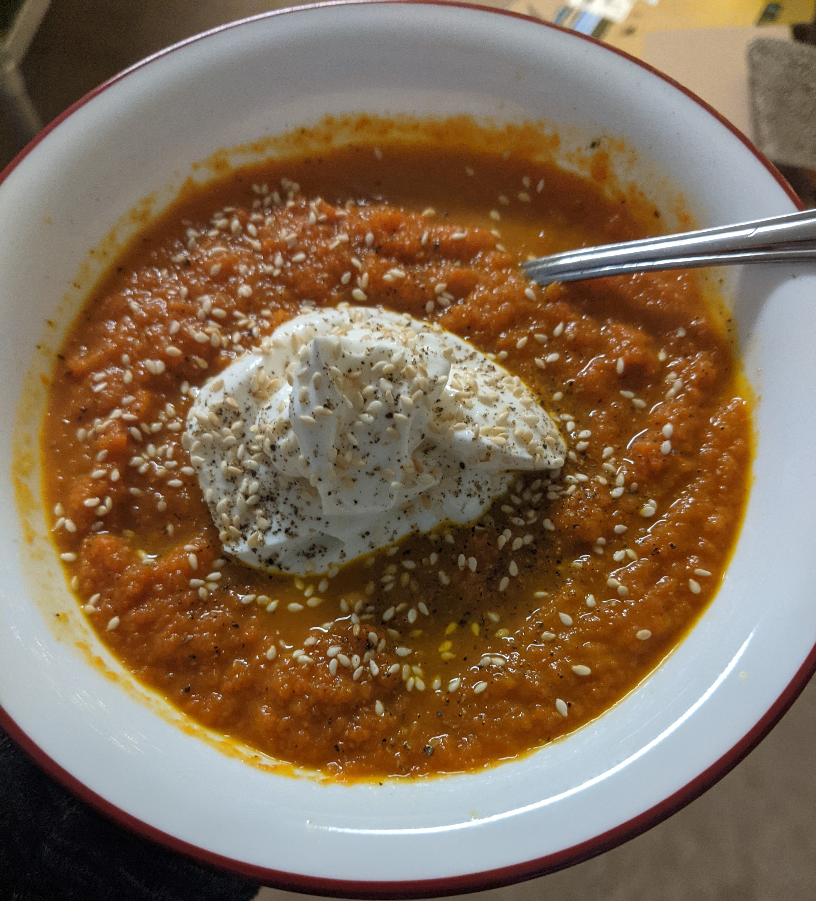
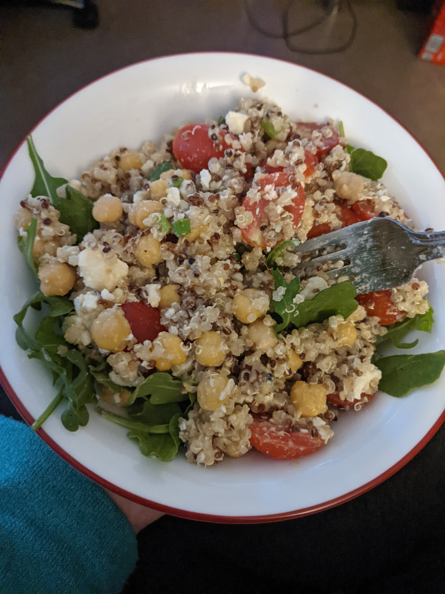
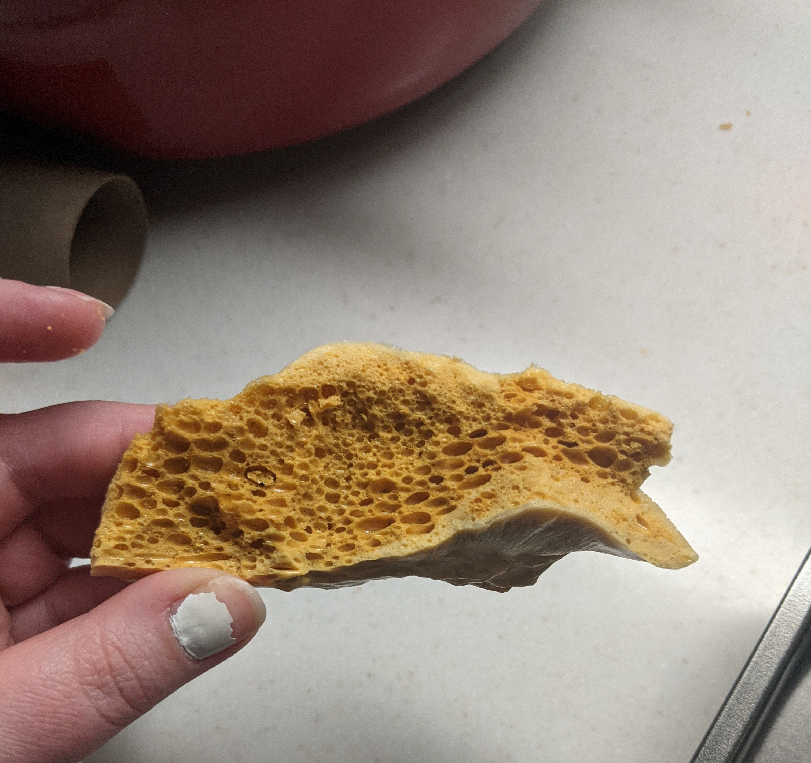
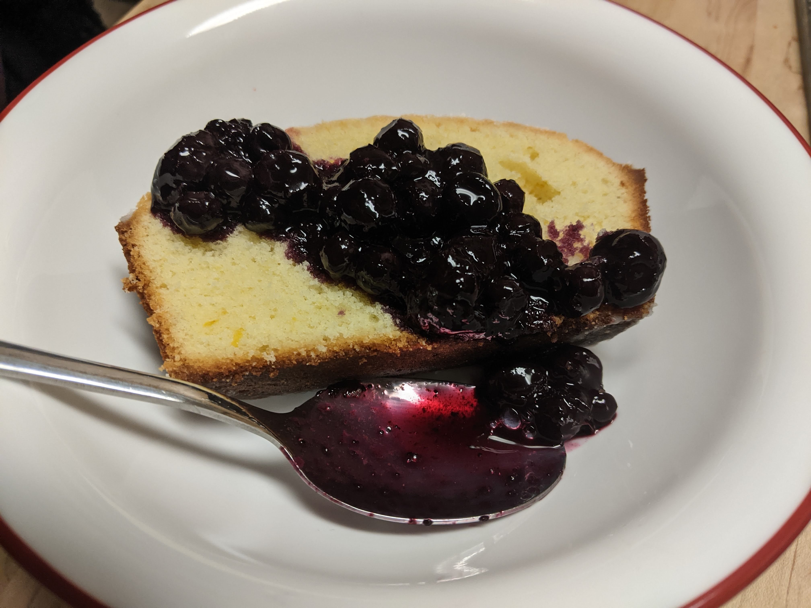
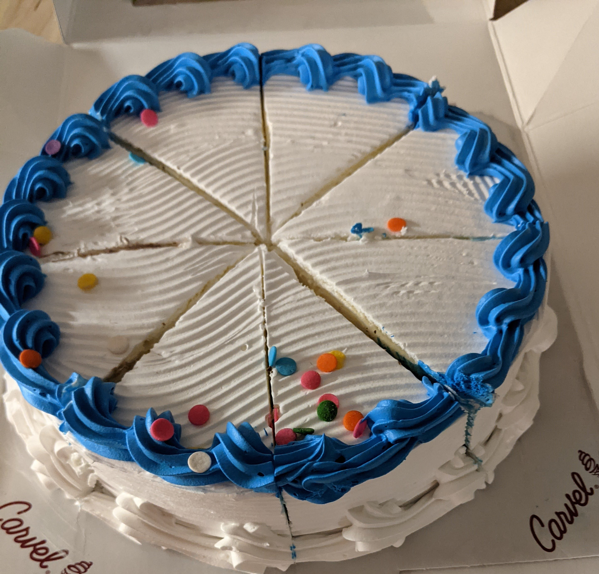

---
categories:
    - Not a Recipe
tags:
    - Baking
    - Bread
    - Cookies
    - Candy
    - Projects
title: "What I Cooked, Baked, and Ate - January 2021"
date: 2021-01-29T09:33:24-05:00
featured: 1
draft: false
description: "A round up of the things I enjoyed making and eating this month"
---

This month for me was about finding my groove in the kitchen again, making food
frequently, and trying to make new things. One of my goals was to bake at least
once a week- and I met that goal! There was also one week where I baked twice,
though one of those creations was a failure, but a failure I will learn from!

### What I Cooked

{{}}

-   Patty Melts (on slices from the Panned Loaf mentioned below)
-   White Bean Soup (recipe to come)
-   Carrot curry soup, topped with Greek Yogurt and toasted sesame seeds
    -   The liquids separated from the blended carrots a bit, so I think I still
        have some work to do one this one, but it was pretty tasty.
-   I made my own hummus for the first time after getting a food processor for
    Christmas. What a delight!
-   Veggie & Grain make ahead salad
    -   Inspiration:
        [BBC goodfood "Help-yourself grain fridge salad"](https://www.bbcgoodfood.com/recipes/help-yourself-grain-fridge-salad)

{{}}

-   Honeycomb candy
    -   My friend Rebekah and I have started a "New Recipe Day" tradition in
        which we both make the same recipe and compare results. For our first
        recipe we tried
        [Homemade Honeycomb Candy](https://www.thepioneerwoman.com/food-cooking/recipes/a88050/homemade-honeycomb-candy/).
        Rebekah's was a little burnt and mine tasted of too much baking soda, so
        I think we both have some changes we'll make, but none the less it was a
        fun night. I imagine this will be a fun activity when we can actually
        cook together as well.

{{}}

### What I Baked

{{}}

-   An overnight Spelt Loaf (recipe to come)
    -   I made this loaf two different times, since I'm still trying to get it
        right, and it is very tasty. It ends up a little flatter than I would
        like. Either I need to change it to a kneaded instead of folded recipe,
        or I need to lower the hydration a little.
-   The Panned Loaf from
    [Bonnie O'Hara's Bread Baking for Beginners](https://bookshop.org/books/bread-baking-for-beginners-the-essential-guide-to-baking-kneaded-breads-no-knead-breads-and-enriched-breads/9781641521192)
    -   This is definitely one of the bread recipes I bake most often. Very
        easy, always delicious, and useful in a variety of recipes.
-   Lemon Drizzle Cake (recipe to come). Topped with some blueberry sauce I
    threw together from the last of the blueberries in my freezer.
-   Failed burger buns (recipe to come, eventually)
    -   I think my apartment was really cold, so the rise took quite long, and
        really could have gone for much longer. This will be a work in progress
        for a little while.

### Other things I Ate

{{}}

-   [Yokohama Butter Sandwich Cookies](https://www.bokksu.com/products/yokohama-butter-sandwich-cookie?_pos=2&_sid=a7561bf62&_ss=r)
    that my mom got us from Bokksu for Christmas. These cookies are so freaking
    good. I finished them early in the month and I still think about them at
    least once a week.
-   Carvel Ice Cream Cake! January is my birthday month, so the hubs and I
    celebrated with ice cream cake, which we ate over the course of several
    days. It was like celebrating my birthday everytime we had a slice.
-   A few different open faced toasts on the spelt loaf
    -   Peanut butter and banana with honey
    -   Hummus and everything bagel seasoning
    -   Bacon, egg, and cheese with everything bagel seasoning
