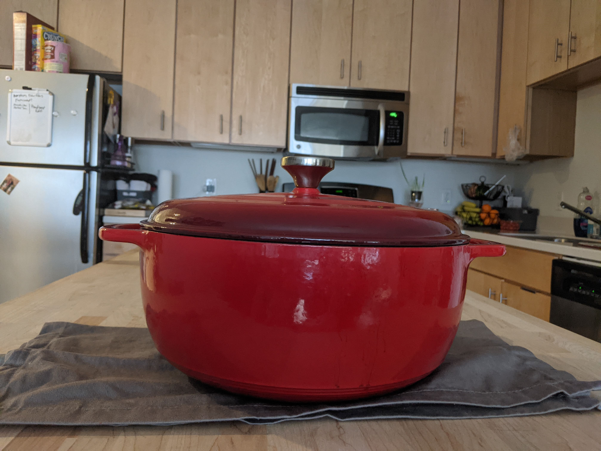
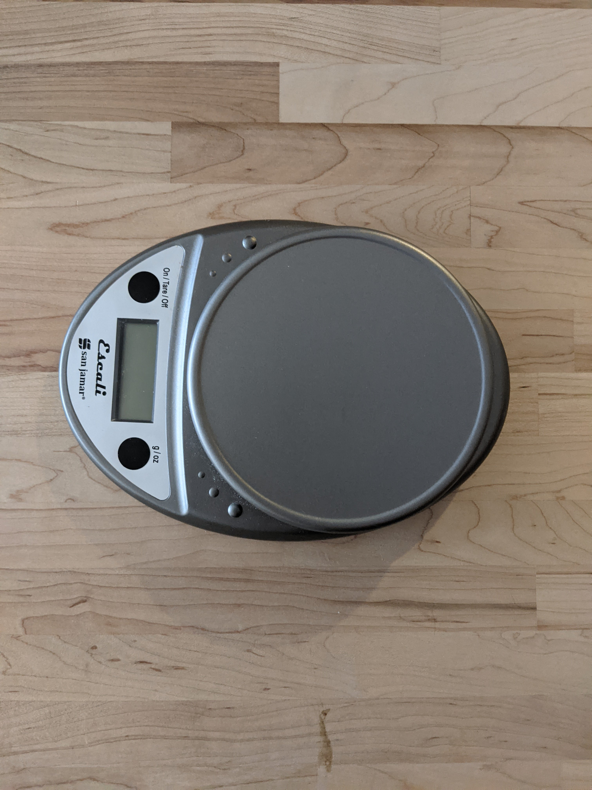

---
categories:
    - Not a Recipe
tags:
    - Tools
title: "Kitchen Essentials"
date: 2020-08-09T15:01:53-05:00
featured: -1
draft: true
description:
    "Things I think are essential (and then some stuff I just like to have"
---

{{}}

One of the things you’re going to notice in my new recipe posts is that I am
listing the tools/equipment you’ll need for the recipe at the top with the
ingredients. If I’m gathering all of my ingredients for a recipe, it makes sense
to also gather the tools as well. This means I’m less likely to dig through my
utensil drawer for a bench scraper with flour covered hands, and that’s better
for everyone.

I also figured it might be nice to have one place where I list everything I like
to have in the kitchen, so I’ve made a
[Resources]( "Resources") page. I’ll
update this page as I find more things I like to have in the kitchen, as I
realize certain things are my essentials, and as I find more general food
resources that I love.

The tools are broken down into two sections: essentials and things that are nice
to have. Depending on how much cooking you do, some things are going to be more
important than others. And if I could technically function in the kitchen
without it, it went on the “things that are nice to have” list.

## Some thoughts on things I think are essential:

For me, a kitchen scale is non-negotiable if I’m baking. When baking,
measurements by weight are the way to go. I don’t really use the scale when
cooking, but I also don’t cook a lot of things that require precise
measurements. If I’m not trying to record ingredients for a recipe I’m very much
a “pinch of this”, “just enough of that”, “you’ll know when you’ve put the right
amount in” kind of gal.

{{}}

I also can’t go back to living without a pepper grinder. Fresh ground is just
worlds apart, and I hate myself a little as I write that ‘cause it feels
pretentious AF, but every time I put fresh cracked pepper on something, I love
myself again.

## Things that are nice to have:

Anything bread related I bought because I was on a sourdough kick for a while
(before I killed my starter, RIP Sir Sourbucks) with the exception of the dutch
oven. I had read a lot of recipes that said if you don’t have a dutch oven you
can replicate (to a certain degree) the steam by placing a pan of water in the
oven with your bread, and removing at the time you’d usually remove the dutch
oven lid. And they were right, it does do the trick, sort of. But my first loaf
of bread in my dutch oven had THE BEST CRUST EVER, and I am never going back.

Spray bottles (for water) are also super useful for bread baking, but I also
find that I use it to add a little water to something drying out in a frying
pan, other occasions when I want something ever so slightly damp.

If you’re interested in what I think is a kitchen essential, or where I like to
get my food information, check out the
[Resources]( "Resources") page. If you
check out my no knead bread post (coming next week!) and decide “shit, I guess
I’m buying a kitchen scale” you’ll find a link to the one I bought there.
