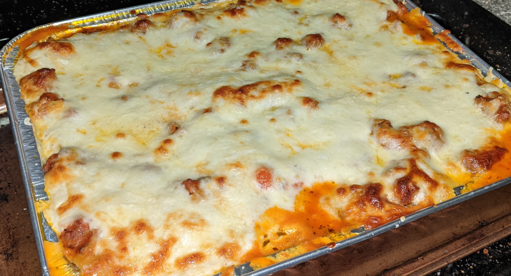

---
categories:
    - Recipe
tags:
    - Dinner
    - Meat-based
    - Pasta
title: "Lasagna"
date: 2020-04-12T15:27:04-05:00
draft: false
description: "The only way I will eat lasagna"
featured: 1
---

{{}}

## Ingredients

### Meat Sauce

-   2 lbs Sweet Italian Sausage (could also go half hot, half sweet. Sweet is
    what we had in the house last week when we made this)
-   Two 28 oz cans whole peeled tomatoes
-   4-6 cloves of garlic, sliced thinly
-   2 medium carrots, small dice
-   1.5 small yellow onions, small dice
-   2 tbsp tomato paste
-   3-4 stems fresh basil (leaves & all)
-   2 tsp Dried oregano
-   Salt
-   Pepper

### Bechamel

Bechamel is pretty straight forward. We use
[Epicurious' Bechamel recipe](https://www.epicurious.com/recipes/food/views/white-sauce-or-bechamel-sauce-40046)
when we forget the ratios.

### Other Components

-   1 lb lasagna noodles (**not** the “oven ready- no boil” kind)
-   16 oz Whole Milk, Low Moisture Mozzarella Cheese- (we used a block of cheese
    and grated it ourselves this time, but there have been plenty of times in
    the past, and I’m sure there will be plenty of times in our future, where we
    used pre-shredded mozz)
-   Romano, Parmesan, similar for grating over the top of the lasagna. No
    measurement here, do what _feels_ right

## Method

### Making the Meat Sauce

1. De-case the sausages, break them up into chunks and place in a large sauce
   pot (the one we have right now is non-stick, but it definitely doesn’t _have_
   to be a non-stick pan).

2. Heat the pan with the sausage to medium-high and leave the sausage to develop
   some color, maybe 5 minutes or so, before breaking up with a spoon. Stir and
   continue to break up the sausage until its 90-95% cooked. Remove sausage from
   the pan, leaving a little bit of the fat behind for the next step.

3. Set the sausage aside to cool at room temp. Once cooled, this can go in the
   fridge, as the sauce is going to cook for quite a bit without it first.

4. In the pan with the sausage fat, add onion, carrots, and a pinch or two of
   salt, and cook on medium or medium-low heat until the onions are translucent.

5. Add the garlic and cook until fragrant, then add the tomato paste and dried
   oregano, stirring and cooking about a minute.

    - _Depending on how much garlic you like, you may go with 4 cloves here, or
      more. I started with 4 at this step, tasted after blending (step 9) and
      decided to add more garlic when I added the sausage back in. This is a
      garlic loving household._

6. Add the tomatoes, either crushing with your hands as you put them in the pot,
   or use kitchen shears to cut the tomatoes up in the can before dumping in.

    - _Sometimes I really enjoy getting my hands dirty and squishing the
      tomatoes by hand, this last time I was trying to do about 10 different
      things at once, and the shears were quicker._

7. Add the basil, leaves and stems, and let everything come to a boil. Once the
   sauce comes to a boil, drop the heat to low, put a lid on and let it cook for
   at least an hour. My deciding factor for when to move on to the next step was
   when the carrots were softened enough that I knew my immersion blender
   wouldn’t have any trouble with them.

8. Once you’re confident your blender of choice can successfully pulverize your
   ingredients, shut off the heat and let the sauce cool. Hot liquid + blender =
   bad times.

9. Blend until you have a sort of smooth sauce. You don’t want any huge chunks
   of veggies, but it doesn’t need to be perfectly smooth.
10. Add the sausage, return the pot to the heat (on low) and let cook for at
    least another hour. Season with salt and pepper to taste before assembly.
    This can sit on low heat while you prep the rest of the ingredients.

    - _This is probably enough sauce for two lasagnas. We made one whole
      lasagna, some lasagna roll ups (more on that below) and had enough sauce
      to freeze for another meal down the road._

> There was some heated debate between the hubs and I as to whether leaving the
> whole basil stems in when I blended the sauce was a good move or not. He
> insisted they were bitter and the sauce was going to be bitter. I insisted he
> was wrong. The sauce was in fact, **not** bitter, so if you don’t feel like
> fishing basil stems out of your sauce before blending– don’t!

### Rest of the Prep

1. If your cheese is not pre-shredded, once your meat sauce is made, shred on
   the large wholes of a box grater and set aside.

2. Make the bechamel (link to the recipe we use is above). We removed ours from
   the heat once it was done so it didn’t continue to thicken.

3. Bring a large pot of water to a boil and salt generously.

    1. Gently put lasagna noodles in the boiling water, trying to keep the
       noodles intact.
    2. Cook the pasta at least a couple minutes shy of what the package says is
       “al dente” – this is going to bake in the oven with sauce, so you don’t
       want the noodles to end up over done and mushy. Our package said 10
       minutes- we cooked for 6 and then drained and began assembly.

4. In a large baking dish, casserole dish, or in our case, a foil steam pan,
   start with a thin layer of the meat sauce. This will help prevent the noodles
   from sticking and/or burning to the bottom of the baking dish.
5. After the initial thin meat sauce layer, add a layer of noodles, then meat
   sauce, then bechamel, then shredded mozzarella, and repeat until your baking
   vessel is almost filled to the top. For us, this left 4 lasagna noodles
   unused (_don’t worry- they were re-purposed into lasagna roll ups_). You’ll
   want to end on a shredded mozz layer, and finish with grated Parmesan,
   Romano, or similar.
    1. _The hubs and I like to alternate the direction of the noodles each
       layer. (So, first layer the noodles run horizontally in the pan, the next
       layer we trim them and they run vertically, and so on). We’re also not
       opposed to using trimmed noodle pieces to make up for a whole noodle._
    2. _We think the alternating helps the lasagna slices stay together when
       they’re cut. Not sure if this is true, but its how we’ve always made it,
       and it works just fine for us._

{{}}

6. Bake at 350 F for 30 minutes uncovered. When you check the lasagna at 30
   minutes, if the top isn’t browned, you can either bake for longer, or get
   impatient like we did and just crank the heat to 400 or so and give it
   another 5 minutes.

## Notes (a.k.a. How this came to be my favorite lasagna)

I used to think i hated lasagna, until I found out that it can be made with
bechamel instead of ricotta. (Which, I didn’t know for 24 years.) I’m not saying
ricotta lasagna is bad, I’m just saying it’s not the lasagna for me.

For the meat sauce- given the choice between plain ground beef, or Italian
sausage, I will always choose the sausage. Every. Single. Time.

{{}}

Bonus! Lasagna roll ups- filled with bechamel, on a layer of meat sauce. These
were then topped with a little more meat sauce, bechamel, and Romano cheese.
Then put in the freezer for future use. We’ll defrost in the fridge over night,
and put in the oven covered at 350 F for maybe 30 minutes or so.
