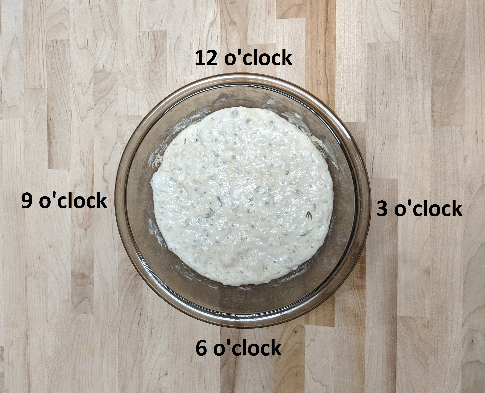
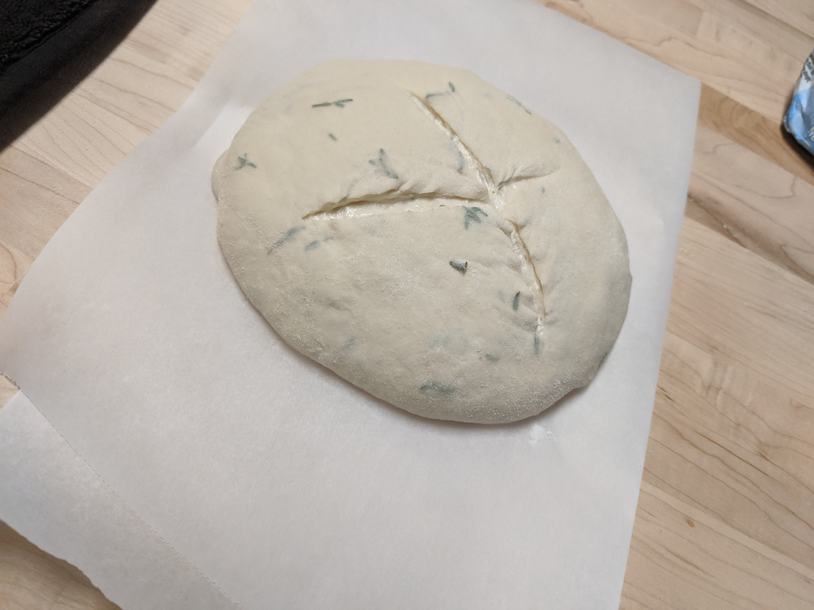

---
categories:
    - Recipe
tags:
    - Baking
    - Bread
    - No-knead
title: "My Favorite No Knead Bread"
date: 2020-08-15T21:39:42-05:00
featured: 1
draft: false
description: "An easy overnight loaf made with all purprose flour"
summary: ""
---

{{}}

## Tools

### (Check out my [Resources]( "Resources") page for links and other tools I like to have in the kitchen)

-   Kitchen scale
-   Small containers for weighing/separating ingredients
-   Mixing bowl (2 qt or larger)
-   Plastic wrap, or clean shower cap
-   Bench scraper (optional, but useful)
-   Parchment paper
-   Kitchen towel, lightly floured
-   Dutch oven
-   Lame (or knife)

## Ingredients

-   250g All Purpose Flour + a little more for dusting work surface
-   175g Warm water
-   7g salt
-   3g active dry yeast
-   2 tbsp thyme (optional)
-   Couple splashes of olive oil (optional)

For those using baker’s percentages: This dough is 70% hydration, almost 3%
salt, with a little over 1% yeast. My scale only displays in whole grams, not
decimal points, so there is a bit of approximation that happens when I measure.
Technically you would want 7.5g salt and 2.5g of yeast. I’ve rounded up the
yeast and down the salt, and in previous bakes vice versa, and it’s turned out
okay.

I’ve been using my spare time to learn a little web development and programming,
and my most recent project has been a Baker’s calculator. You can check that out
[here](https://dana.harrigan.info/bakers-calculator/), if you are so inclined.
You can enter percentages and figure out how much of everything else you need,
and there is a regular recipe scaling calculator as well.

For more info on baker’s percentages, check out King Arthur Flour’s detailed
[explanation](https://www.kingarthurbaking.com/pro/reference/bakers-percentage#:~:text=Reference-,Bakers%20Percentage,is%20always%20expressed%20as%20100%25.).

## Method

1. Weigh out water and yeast in small containers.
2. Mix the yeast into the water and let sit for 5-10 minutes until dissolved and
   a little foamy.
3. Weigh out flour into the mixing bowl.
4. If you are adding thyme or other herbs, mix them into the flour for even
   distribution.
5. Weigh out salt in a small container.
6. Mix the water & yeast mixture into the flour and add salt.
7. If you are adding olive oil, add that now so it is evenly mixed in the dough.
8. Use your hands to incorporate the ingredients into a mildly shaggy mass of
   dough.
   {{}}
9. Keep the dough in the bowl and cover with plastic wrap or shower cap.
10. Let the dough rest for 12 -14 hours. You’ll notice it about doubles in size
    and kind of takes on the shape of the bowl.
    {{}}
11. After it has rested, fold the dough on itself a few times, thinking about
    the blow like a clock:
    {{}}
12. Starting at 12 o’clock, pick the edge of the dough up and fold it down
    towards 6 o’clock. You’ll notice all my pictures have the folding edge in
    the 12 o’clock position, I tend to rotate the bowl as I go, so that the
    piece I’m folding is always at the top.

    1. Take 3 o’clock and fold towards 9;
    2. Take 6 o’clock and fold towards 12;
    3. Take 9 o’clock and fold towards 3.

    {{}}

13. One set of folds is likely sufficient for this recipe. If the dough is
    really slack and not holding its shape as you fold, you can go around making
    folds for a 2nd or 3rd time. I had to give mine another set of folds to
    bring it a little tighter.
    {{}}

14. After folding, cover the dough in the mixing bowl with plastic wrap or a
    shower cap and rest the dough for another 1 to 2 hours.
15. Shape the dough into a loaf:

    1. Turn the dough out of the mixing bowl on to a floured work surface.The
       side of the dough that was in contact with the bowl should be facing up.
    2. Fold the dough using the same clock based method from earlier, bringing
       it into a round-ish shape
    3. If you have a bench scraper, use it to get under the dough and flip it so
       the folded side is in contact with the work surface. If you don’t have a
       bench scraper, your hands work just fine for this as well, just flip with
       confidence.
    4. Flipping the dough will cause the smoother side to be facing up, which is
       what you want for a pretty loaf.
    5. Cupping your hands around the edges of the loaf, tuck the sides and drag
       the loaf across the board to seal the bottom and create surface tension.
       This part takes some practice and I’m still working on my technique here.
       You could probably skip this part, but it will affect how your dough
       rises in the oven. More surface tension = tighter loaf = more controlled
       rise.

16. Transfer the shaped loaf to a piece of parchment paper using your bench
    scraper or hands and cover with a lightly floured kitchen towel.
    {{}}

17. Rest the shaped loaf for about 30 minutes while the oven preheats. You’re
    looking for the dough to grow in size a little, and when you gently poke it,
    it should hold an indent.

18. Preheat your oven to 425F and place your dutch oven inside to preheat as
    well. This should happen as the shaped loaf is resting.

    - Enameled dutch ovens apparently shouldn’t be heated empty, so I’ve been
      putting some water in mine for the preheat step. I just dump out any water
      that isn’t evaporated by the time I’m ready to put my bread in.

19. When the loaf has rested and the oven is preheated:

    - Use a lame or knife to cut an X into the top of the loaf. This will help
      direct the steam as it escapes during baking and help maintain the shape
      of your loaf. Don’t worry if it is a looking a little falt- the dutch oven
      will work its magic!
      {{}}

20. Carefully remove the lid from the dutch oven (remove any liquid as noted
    above) and use the edges of the parchment paper to lower the loaf inside the
    dutch oven.
    - Replace the lid and bake covered for 20 minutes.
21. After 20 minutes, remove the lid of the dutch oven and bake for an
    additional 15 minutes.
22. When fully baked, the dough should sound hollow if you tap on it. Remove
    from the dutch oven and place on a wire rack to cool completely.

## Notes

Regarding the shower cap: Plastic shower caps make great covers for mixing
bowls. Because of the elastic, it clings around the bowl nicely without drooping
and getting stuck to the bread. Also, if you hang it inside out to dry, you can
get a couple of uses out of it. Once I use up my stock of plastic shower caps, I
might try to move on to properly reuseable ones and see how that works out.

I weigh everything into small containers and then start combining. You could, in
theory, weigh the water, and then tare the scale and weigh the yeast into the
same container with the water, but I certainly don’t have a steady enough hand
to do that and not put way too much yeast in by mistake.

This is a pretty forgiving recipe when it comes to resting and proofing times.
Sometimes I go 12 hours before I fold, sometimes I go 14, and once I waited
almost 16 hours because I decided I wanted to sleep in a little extra. There is
definitely a point of no return with over-proofing, but I think the window is
pretty wide on this one.
