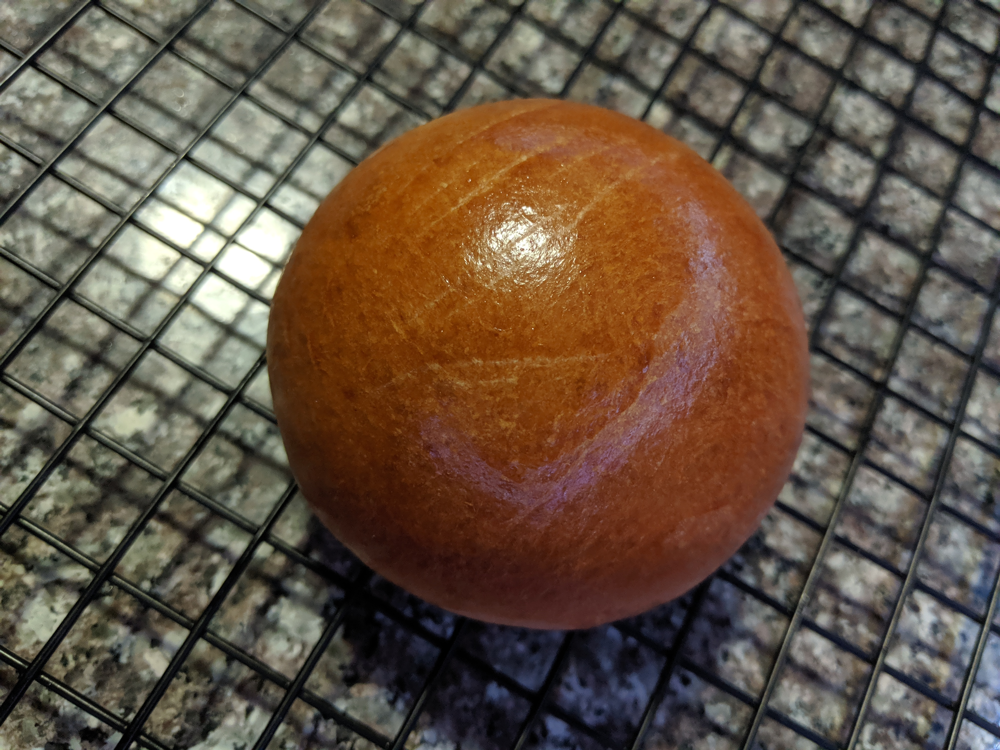

---
categories:
    - Not a Recipe
tags:
    - Ramblings
title: "Hello! Welcome"
date: 2020-01-12T16:12:13-05:00
featured: -1
draft: false
description: "A little hello from me"
---

{{}}

Welcome to my cooking, baking, writing, learning, and growing adventure! I plan
to use this space to document and share my experiences as I tweak and test
various recipes and occasionally force feed the results to my loved ones\*. If
that sounds like something you’d dig, please stick around. I love playing around
in the kitchen, and I especially love sharing food with people, so screaming
into the void that is the internet about it seemed like a semi-logical extension
of that love. (Or at least at a way to give the non-food obsessed people in my
life a break from my ramblings).

As much as I enjoy the process of tweaking a recipe, and finding the differences
that big and small changes can make to a final dish, I appreciate that not
everyone feels that way. If you’ve stumbled across my humble corner of the
internet looking for a recipe for garlic knots, you’re gonna find the recipe for
garlic knots at the top of the post (ya know, once I perfect my garlic knots and
write down the recipe). The final iteration of whatever I’ve worked on will
always come first, at the top of each post, followed by whatever I started with
(recipe, inspiring dish/product, strange passing thought), and my musings on the
various changes I made on the path to the final thing.

As this is just the beginning of my screaming into the void, I have a rough idea
of what I want it to look like– cook/bake, write down results, tweak, repeat
(until satisfied or over it), write something coherent to put out into the
world– but I accept that things may change as I go along. For me the cooking,
and the blogging, is as much about the process as it is about the results.

So, dear void, if anything I’ve said so far interests you, and you keep coming
back- I hope my ramblings bring you entertainment, or the recipe you’re looking
for, or both.

_\*Please note, no loved ones have been harmed in the making of this blog._
