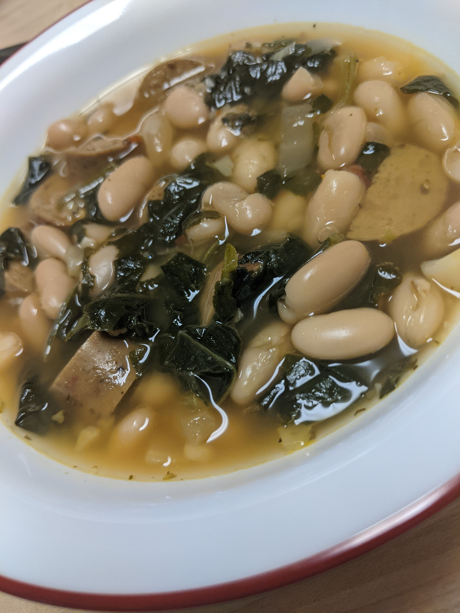

---
categories:
    - Recipe
tags:
    - Soup
    - Plant-based
    - Pantry
    - Beans
title: "White Bean Soup"
date: 2021-03-06T10:00:57-05:00
featured: 1
draft: false
description:
    "A very flexible, easy to make ahead, soup that has kept me warm and full
    this winter."
---

When I started working on this soup, I didn't intend for the final version to be
totally plant-based, but this is my favorite iteration by far. This is a really
flexible recipe with a lot of room for customization and variation, so you'll
find information about possible variations in the notes.

You'll probably notice in the cover photo for this post that there are no
carrots in that bowl of soup. I was out of carrots on my last round of testing
and didn't feel like going to the store. And ya know what? The soup was still
great.

This recipe makes me at least 4 hearty bowls of soup, and I store it in the
fridge for up to 5 days without issue.

## Tools

-   Cutting board
-   Knife
-   3 or 4 quart soup/stock pot
-   Spoon and/or ladle

## Ingredients

-   2 quarts (64 oz) vegetable stock
-   2 (two) 15.5oz cans Cannellini beans
-   1 (one) 14 oz package of sausage
-   3 Medium carrots (about 7.5oz), cut into small pieces
-   6 oz Frozen Spinach
-   2 to 3 cloves garlic, minced
-   1/2 medium yellow onion, chopped
-   1 tbsp olive oil
-   1/8 tsp Crushed red pepper flake
-   1/8 tsp Dried oregano
-   Salt & pepper to taste

## Method

1. Brown sausage in a sauce pot with the olive oil
    - Depening on the sausage you are using, you may want to start with a little
      water in the pan to help cook the sausages through. Though they will cook
      in the soup, I think it is always better to be safe than sorry. When in
      doubt, check the package for cooking instructions.
2. Once browned, remove the sausage to a cutting board. When cool enough to
   handle, cut into semi-circles (or whatever other shape floats your boat).
3. Add the onions to the pot along with the other spices/herbs.
4. Salt the onions lightly and saute until they are translucent.
5. Add the garlic and cook for a minute or so until fragrant.
6. Add the sausage pieces, carrots, and stock and bring to a boil.
7. Simmer the soup until the carrots are your desired level of soft.
    - I like my carrots rather soft, but I also cut them thin, so this only took
      maybe 5-10 minutes of simmering for me.
8. Add the beans and cook until they have heated through, another 5-10 minutes.
9. Frozen Spinach- Add the spinach and cook until it is defrosted and soft.
    - If your spinach packet is the compressed block kind, you’ll want to add it
      in with the beans to allow it to start to break up, unless you’ve
      defrosted it ahead of time (which I never have the forethought to do it
      seems).
    - If your spinach is the kind in a bag that is kind of in frozen clumps -
      Massage the package of spinach to break up any large chunks. This will
      help it cook more evenly in the soup.
10. Add salt and pepper to taste.

{{}}

## Notes & Variations

-   I originally started with just one can of beans, but for a white-bean soup,
    there never seemed to be enough for my liking. If you like a less
    bean-focused soup, go with one can.
-   The brand of sausage I've liked best recently is the Tofurky brand Italian
    plant based [sausages](https://tofurky.com/what-we-make/sausages/italian/).
    The have sun dried tomatoes and a bunch of other Italian seasonings that do
    a lot of the flavor heavy lifting for me. I have aboslutely made this
    without additional herbs and spices when I've been feeling lazy.
    -   In all my tests, I stuck with Italian flavored sausages, whether they
        were chicken, pork, or plant-based, so my additional herbs and spices
        follow that lead. I definitely think it could be changed up with other
        flavors pretty easily.
-   I have used fresh swiss chard in place of the spinach and in that case I
    used about half of the bunch's leaves, chopped (about 7.5 oz) and I used all
    the stems, chopped (4.5oz). The greens in this recipe are absolutely another
    place for variation. Use the greens you like best, and remember they wilt
    down a fair amount.
-   I am no stranger to the pre-minced garlic in a jar and I have used it in
    this soup when I've been out of fresh garlic. Would I skip making this soup
    if I had no fresh or pre-minced garlic? No. I'd throw in some garlic powder,
    accept that it is good but not the same, and have a tasty but different bowl
    of soup.
-   This recipe can either be something you follow closely, or take as a
    starting point to riff off of. I have specific measurements above for
    certain ingreditents (like carrots, or the herbs) so you have an idea of how
    much to use to recreate this recipe as I make it.

Some days, I like to follow instructions and not have to think too much, other
days I like to tinker and experiment and see what I can create. This recipe is
good for both of those days.
